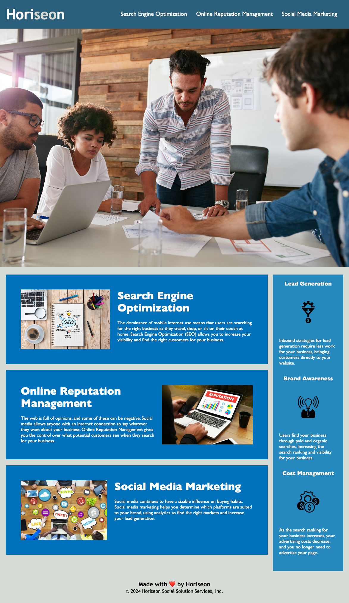

# Challenge 1: Website SEO Rework

## Description

The objective for this assignment was to refactor an existing website to improve accessibility, thusly elevating SEO.
Semantic syntax has been implemented into the provided HTML.
A descriptive title has been added to the page and 'alt' captions have been added to images and icons.

Additionally the CSS style sheet has been consolidated to improve efficiency and reduce redundancy.

A future improvement on this site would be to implement the use of flexboxes and media queries to maintain the page layout proportions/structure when the screen size changes.

## Installation

N/A

## Usage

Opening the [Horiseon Social Solution Services, Inc.](https://eepitsporsche.github.io/website_seo_rework/) webpage displays each subject of SEO with alt text behind each subject's related images/icons.

## Credits

Code provided by UCB bootcamp was treated as written by a marketing agency client.

## License

N/A
